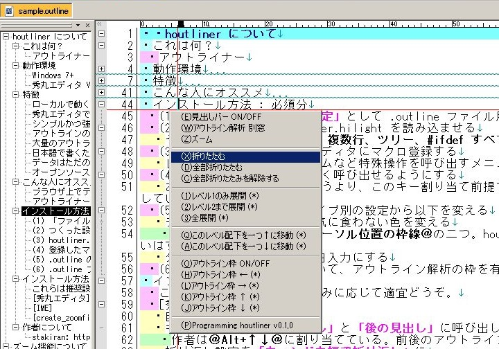
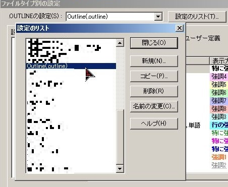
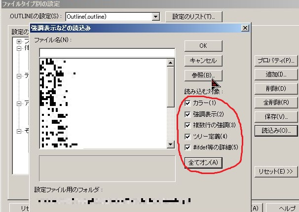
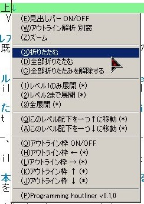
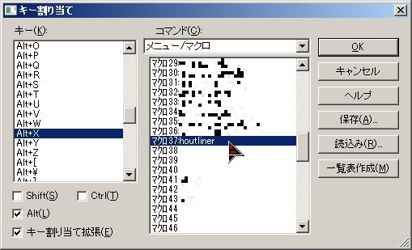
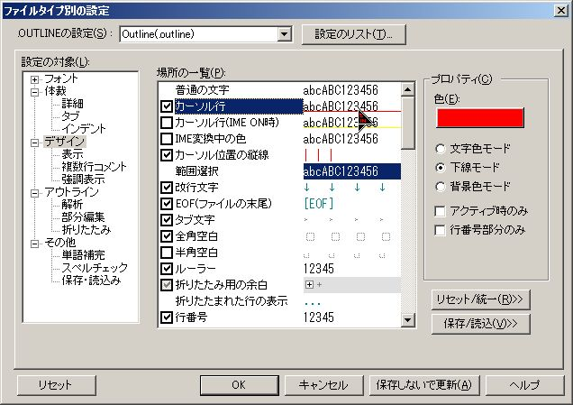
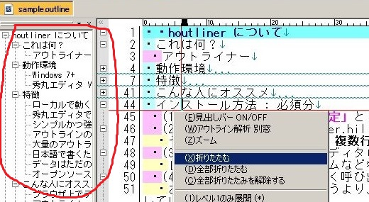
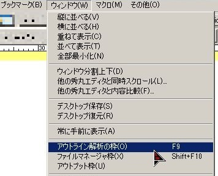
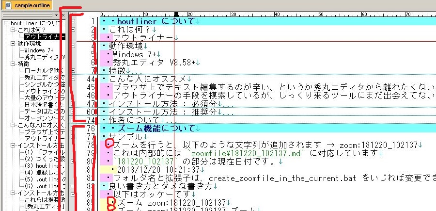

# houtliner
軽くてパワフルなアウトライナーを、秀丸エディタで。



## 特徴
- ローカルで動く
  - 軽い
  - 速い
- 秀丸エディタで書ける
  - 20年以上続いているシェアウェア品質
  - 国産（日本語に強い）
  - 検索/置換、行ブックマーク、ファイルブックマーク、ファイルエクスプローラー……テキストエディタの機能がフルで使える
- シンプルかつ強力な階層コンセプト
  - ファイル …… .outline ファイル。n 個のセクション、n 個のアウトラインを書ける
  - セクション …… アウトラインを n 個書ける単位。「大見出し」みたいなもの
  - アウトライン …… 箇条書きの集合。レベル1, 2, 3, ... とどんどんネストできる
  - ズーム …… 箇条書き一行に対してテキストファイル一つ分の記入領域を確保
- アウトラインのレベル別色分け表示で見やすい
- 大量のアウトラインでも軽々操作できる
  - 折りたたみ機能
  - アウトライン解析の枠、別ウィンドウによる俯瞰
  - 並び替え(上下に移動)
- 日本語で書くために設計された、必要最小限の記法
- データはただのテキストファイルなので管理しやすい
  - Dropbox などに置ける
  - GitHub などに置いてバージョン管理もできる
- オープンソース + 秀丸エディタマクロとバッチファイルのみで完結した実装
  - 無料で使える
  - カスタマイズが容易
  - 何をしているかが全部わかる安心感

## 動作環境
- Windows 7 以上
- 秀丸エディタ V8.58 以上

## インストール方法(必須)
秀丸エディタは既にインストールしているものとします。また、基本的な使い方や設定方法についても知っているものとします。

### (1) ファイル別タイプの設定に .outline ファイルを追加


### (2) つくったファイル別タイプ設定に hilight を読み込み
outline.hilight を読み込ませます。

その際 **カラー、強調表示、複数行、ツリー、#ifdef すべてを「オン」にします**



### (3) マクロ本体を秀丸エディタに登録する
houtliner.mac を登録します。

このマクロは、実行するとメニューを表示し、選択した操作を行うマクロです。



最悪無くても構いませんが、あった方が何かと便利です（たとえば折りたたみ操作を簡単に呼び出せます）。

### (4) 登録した (3) のマクロを素早く呼び出せるようにする
(3) のメニュー項目は頻繁に使うでしょうから素早く呼び出したいです。ツールバーに配置する、キー割り当てを行うなどの方法があります。

おすすめは **Alt + X** にキー割り当てすることです。というより、この割り当て前提でメニューを設計しています。たとえば折りたたみは Alt + X → X というふうに、左手で二段階で呼び出せます。



### (5) .outline のファイルタイプ別設定をカスタマイズする
(2) で outline.hilight からの読み込みを行いましたが、これだけだと一部設定が不十分です。

以下を変更してください。

- 「デザイン」から見づらい色や気に食わない色を変える
  - 特に **カーソル行** と **カーソル位置の枠線** の二つ
- タブの文字数は 1、かつ空白入力にする

他にも気に食わない部分があれば適当に変えてください。



### (6) .outline ファイルの「アウトライン解析の枠」を有効にする
houtliner の肝となるのが秀丸エディタの **アウトライン解析の枠** 機能です。有効にされていない方は、ぜひ有効にしてください。



有効といっても枠を表示すれば良いだけです。(2) のメニューマクロを使うと「アウトライン枠 ON/OFF」項目から表示できます（ただし .outline ファイルを開いている時ではないと効きません）。あるいは以下のように ウィンドウ > アウトライン解析の枠 からも表示できます。



## インストール方法(推奨)
以下は推奨設定です。お好みに応じて適宜どうぞ。

### 秀丸エディタ
- 自動インデントにする
- キー割り当てで「前の見出し」と「後の見出し」に呼び出しやすいショートカットキーを割り当てる
  - 作者は **Alt+↑↓** に割り当ててます
  - 前後のアウトラインにサクサク移動できて便利

### IME
- **スペース入力は常に半角** にする
  - houtliner は半角スペース n 個でレベル n を表現します
  - 全角スペースだと(半角スペースを打つための)切り替えが面倒くさいです

### create_zoomfile.bat
ズーム機能用のファイルです。現状ではフォルダ名が「zoomfiles」、拡張子は「.md(Markdown)」。

- 気に食わないならバッチファイルを開いて適宜変えること

## 使い方
試しに outline.hilight を開いて、色々といじってみましょう。文法や各種機能などもこのファイルに書いてあります。

## 詳細ガイド
本項では houtliner のコンセプト、文法、機能や操作方法などを解説します。

### 情報の構造について
ファイル、セクション、アウトライン、ズームがあります。



赤線の外側からファイル、セクション、アウトライン、そして丸で囲んだ行がズームを持つ行です。

ファイルとは **.outline ファイル** です。n 個のセクションまたは n 個のアウトラインを書きます。

セクションは `・・` で始まる行で、「大見出し」みたいなものです。n 個のアウトラインを包含します。

アウトラインは `・` で始まる行の集合です。 **箇条書き** ですね。レベルがあります。レベル n は先頭に半角スペースを n-1 個付けます。レベルに制限はありませんが、 **色付けされるのはレベル 6 まで** です。

```
・レベル1
 ・レベル2
  ・レベル3
   ・レベル4
    ・レベル5
     ・レベル6
      ・レベル7
       ・レベル8
```

ズームは行一つに対して、テキストファイル一つ分の記入領域を拡張する概念です。行内に zoom:181221_090324 のように書きます。実体は `zoomfile\181221_090324.md` です。保存フォルダ名と拡張子は変更できますが、フォルダの場所は変更できず「.outline ファイルのあるフォルダ」固定です。

### 文字装飾など文法について
以下をサポートしています。

- 引用
- （TODOリストなどの）完了
- 太字
- かっこ（「」と『』）
- リテラル

**引用** は、先頭に `>` または `＞` を書きます。文章を引用したい時に使うと、色分けにより引用部分を識別しやすくなります。

```
・＞引用
```

**（TODOリストなどの）完了** は、先頭に `x` または `X` または `Ｘ` または `ｘ` を書きます。アウトラインを TODO リストとして書き並べた後、完了の目印を付けるのにお使いいただけます。

```
・タスク
・タスク
・xタスク（これは完了）
・ｘタスク（これも完了）
```

**太字** は、該当部分を `＠` で囲みます。全角のアットマークです。半角は使えません。これは日本語入力でどんどん書いていくことを想定した仕様です。

```
・太字にしたい場合は＠このように＠囲んでやります
```

**かっこ** についても強調文法があります。`「」` と `『』` の二つです。

```
・「かぎかっこ」 強調したい時に
・『二重かぎかっこ』 強調したい時に
```

最後に **リテラル** は、バックチック(Shift + @)で囲みます。計算式やコードなどの記載に向いています。Markdown などで知られる文法で、主にエンジニア向けですね。使いたい方はお使いください。

```
・35 年間、毎月 1 万円を積み立てると、総額は `35 * 12 * 10000 = 4200000` 420 万円となります
```

### houtliner のアウトラインと秀丸エディタのアウトラインについて
紛らわしいですが重要なのでここで抑えておきます。

houtliner におけるアウトラインとは、あくまで `・` で始める箇条書きのことです。一方、秀丸エディタのアウトラインとは **特定の行を見出しとみなし、見出しをまとめたもの（アウトライン）を俯瞰したり操作したりする画面や機能** のことです。

houtliner のマクロを実行すると「アウトライン解析」や「アウトライン枠」といった用語が出てきますが、これらは秀丸エディタのアウトラインを指します。

houtliner では、この秀丸エディタのアウトラインは **「セクション」と「(houtlinerの)アウトライン」のレベル2まで** となります。レベル3以下は認識されません。

それからもう一つ、houtliner のメニュー項目には `(*)` が付いたものがありますが、これは「アウトライン枠」を有効（表示）していないと使えない機能です。

### 操作について
各メニュー項目について説明します。（画像は v0.1.0 のものです）

ただし秀丸エディタ自体の機能については解説しません。


**見出しバー ON/OFF** は、「見出しバー」の表示非表示を行います。見出しバーがあると、現在行がどのセクションのどのアウトラインにあるのかが一目でわかります。

**アウトライン解析 別窓** は、「アウトライン解析ウィンドウ」を開きます。このウィンドウを使うと、秀丸エディタのアウトラインベースでファイル全体を俯瞰したり、ジャンプしたりできます。

**ズーム** は、現在行に対してズームを作成します。既にズームが存在する場合は、それを開きます。

**折りたたむ** は、現在行以下のアウトラインをすべてたたむ、またはたたんでいたものを展開する動作になります。たためない場合は何も起きません。セクションをたたむこともできます。

**全部折りたたむ** は、セクションとアウトラインレベル1の単位ですべてをたたみます。逆に解除は、たたんである部分を全部解除します（レベル2以下でたたんでいる部分も解除します）。

**展開** は、秀丸エディタのアウトラインに絡む機能(当該機能には `(*)` がついています)で、アウトライン枠中の表示をレベル1のみたたむ(セクションのみ見える)、レベル2でたたむ(セクションとアウトラインレベル1まで見える)、すべて解除する(レベル2まで見える)、といった動作になります。

**一つ↑↓に移動** は、現在行のセクションやアウトラインを一つ↑または↓に移動します。移動は秀丸エディタのアウトラインベースで行われます。つまりセクション、アウトラインレベル1、レベル2のみが対象です。レベル3以下にいる時にこの操作を行うと、そのレベル3以下の行を持つレベル2が移動の対象となります。

**アウトライン枠** は、「アウトライン枠」を表示非表示にしたり、表示位置を上下左右に変えたりします。この枠は、秀丸エディタのアウトラインを表示するものです。ここでドラッグ&ドロップをして並べ替えたりすることもできます。

**Programming houtliner** は、houtliner のマクロを秀丸エディタで開きます。houtliner マクロを素早く編集することができます。直接マクロのソースコードをカスタマイズする方以外は用は無いと思います。

## 更新履歴
[changelog.md](changelog.md) 参照。

## ライセンス
[MIT License](LICENSE)

## 作者
[stakiran](https://github.com/stakiran)
